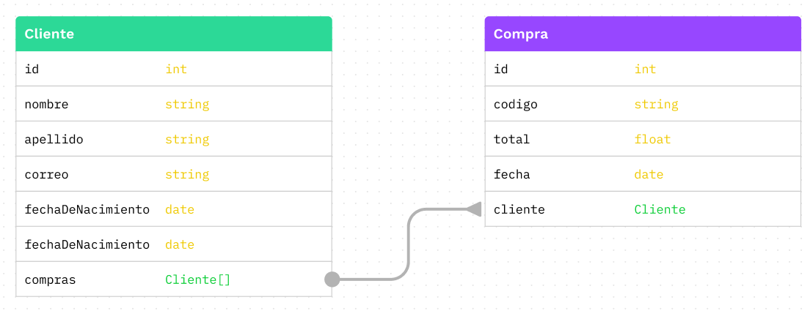
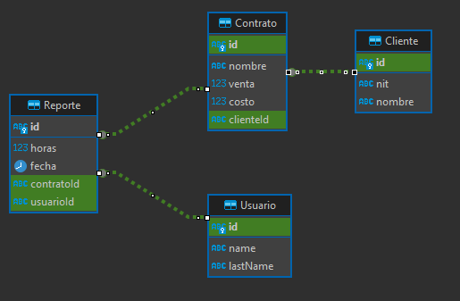

# Examen parcial de Bases de datos Empresariales

### 1. Construcción de un Diagrama Entidad-Relación (40%)

**Instrucción:**  
Construye un diagrama Entidad-Relación (ERD) basado en la siguiente descripción del negocio.

**Descripción del negocio:**  
Una academia de música llamada "Notas y Acordes" ofrece clases de diversos instrumentos musicales. La academia cuenta con un catálogo de cursos, cada uno con un nombre, descripción, nivel de dificultad (básico, intermedio, avanzado), y precio. Los estudiantes pueden inscribirse en uno o más cursos. Cada estudiante tiene un nombre, correo electrónico y teléfono. La academia también registra a los instructores, quienes imparten uno o varios cursos. Cada instructor tiene un nombre, especialidad y años de experiencia.

**Consideraciones:**

- Un estudiante puede inscribirse en múltiples cursos.
- Cada inscripción está asociada a un solo curso y a un solo estudiante.
- Un curso puede ser impartido por múltiples instructores.
- Un instructor puede impartir múltiples cursos.

**Criterios de calificación:**

- Las relaciones están bien mapeadas (10%).
- El diagrama cumple con el estándar visto en clase (15%).
- El diagrama refleja correctamente la descripción del negocio (15%).

---

### 2. Construcción del Script de Creación de Tablas en SQL (10%)

**Instrucción:**  
Construye el script de creación de tablas en SQL basado en el siguiente diagrama ER.



---

### 3. Consultas SQL Basadas en el Diagrama E-R (50%)

**Instrucción:**  
Considera el siguiente diagrama ER.



Este diagrama E-R está diseñado para gestionar la información operacional de una empresa que maneja relaciones contractuales con diversos clientes y registra las actividades de los empleados a través de reportes de horas. La estructura del esquema facilita el seguimiento y la administración eficiente de los siguientes componentes clave del negocio:

- **Usuarios:** Representa a los empleados de la empresa. Cada usuario tiene un registro único identificado por un ID, y el esquema permite almacenar nombres y apellidos opcionales. Los usuarios son responsables de crear reportes que documentan las horas trabajadas en diversos proyectos o contratos.
- **Clientes:** Esta entidad almacena información sobre los clientes de la empresa. Cada cliente tiene un ID único y campos opcionales para el NIT y el nombre. Los clientes son fundamentales para el negocio, ya que mantienen contratos activos que generan ingresos.
- **Contratos:** Los contratos son acuerdos comerciales entre la empresa y sus clientes. Cada contrato, identificado también por un ID único, tiene asociado un nombre y valores de venta y costo que ayudan a evaluar la rentabilidad de cada acuerdo. Cada contrato está vinculado a un cliente específico y puede tener varios reportes asociados.
- **Reportes:** Los reportes son registros detallados de las actividades realizadas por los usuarios, donde se documentan las horas dedicadas y las fechas específicas de trabajo. Estos reportes están vinculados tanto a los contratos bajo los cuales se realizan las actividades como a los usuarios que las ejecutan.

**Preguntas y calificación:**
Cada pregunta tiene un valor de 10%, dividido de la siguiente manera:

- Respuesta correcta: 5%
- Correcta formulación del query en SQL: 5%

**Credenciales para conectarse a la base de datos:**

```
host: aws-0-us-east-1.pooler.supabase.com
port: 6543
database: postgres
username: parcial.pqihitksbcrxfddfmzfg
password: ***********
schema: parcial
```

**Preguntas:**

1. Escribe una consulta SQL que calcule el total de ingresos generados por cada cliente a través de sus contratos. Debes sumar el valor de las ventas de todos los contratos asociados a cada cliente y mostrar el nombre del cliente junto con los ingresos totales.

   - **Pregunta:** ¿Cuál es el top 3 de clientes que han generado más ingresos? ¿Cuánto ingreso generó cada uno de ellos? (10%)

2. Formula una consulta SQL que calcule el total de horas trabajadas reportadas por cada usuario durante julio de 2024. Los resultados deben incluir el nombre, apellido y total de horas reportadas de cada usuario.

   - **Pregunta:** ¿Cuál es el top 3 de usuarios con más horas reportadas en julio de 2024? ¿Cuántas horas reportó cada uno de ellos? (10%)

3. Crea una consulta SQL que calcule el total de horas reportadas en cada contrato durante el año en curso. Los resultados deben incluir el nombre del contrato y el número total de reportes.

   - **Pregunta:** ¿Cuáles son los 3 contratos con más horas reportadas durante 2024? ¿Cuántas horas se han reportado en cada uno de ellos? (10%)

4. Formula una consulta SQL que muestre el total de horas trabajadas por mes y año durante 2023.

   - **Pregunta:** ¿Cuál fue el mes con más horas trabajadas en 2023? ¿Cuántas horas se trabajaron en ese mes? (10%)

5. Construye una consulta SQL que calcule el reporte de horas más grande generado por cada usuario.
   - **Pregunta:** ¿Cuáles son los dos usuarios con los reportes individuales más grandes y cuántas horas reportó cada uno? (10%)
