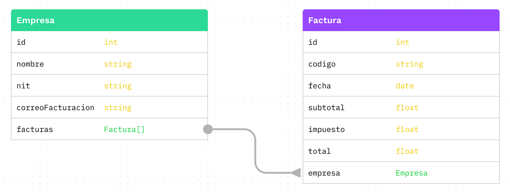

# Examen parcial de Bases de datos Empresariales

### 1. Construcción de un Diagrama Entidad-Relación (40%)

**Instrucción:**  
Construye un diagrama Entidad-Relación (ERD) basado en la siguiente descripción del negocio.

**Descripción del negocio:**  
Una plataforma de streaming de películas llamada "CineStream" ofrece acceso a una variedad de contenido audiovisual. La plataforma mantiene un catálogo de películas, cada una con un título, director, género, año de lanzamiento y duración. Los suscriptores pueden agregar múltiples películas a su lista de reproducción. Cada suscriptor tiene un nombre de usuario, correo electrónico y fecha de suscripción. CineStream también registra a los estudios de cine, quienes producen una o varias películas. Cada estudio tiene un nombre, país de origen y año de fundación.

**Consideraciones:**

- Un suscriptor puede agregar múltiples películas a su lista de reproducción.
- Cada entrada en la lista de reproducción está asociada a una sola película y a un solo suscriptor.
- Una película puede ser producida por múltiples estudios (en caso de co-producciones).
- Un estudio puede producir múltiples películas.

**Criterios de calificación:**

- Las relaciones están bien mapeadas (10%).
- El diagrama cumple con el estándar visto en clase (15%).
- El diagrama refleja correctamente la descripción del negocio (15%).

---

### 2. Construcción del Script de Creación de Tablas en SQL (10%)

**Instrucción:**  
Construye el script de creación de tablas en SQL basado en el siguiente diagrama ER.



---

### 3. Consultas SQL Basadas en el Diagrama E-R (50%)

**Instrucción:**  
Considera el siguiente diagrama ER.


Este diagrama E-R está diseñado para gestionar la información operacional de una empresa que maneja relaciones contractuales con diversos clientes y registra las actividades de los empleados a través de reportes de horas. La estructura del esquema facilita el seguimiento y la administración eficiente de los siguientes componentes clave del negocio:

- **Usuarios:** Representa a los empleados de la empresa. Cada usuario tiene un registro único identificado por un ID, y el esquema permite almacenar nombres y apellidos opcionales. Los usuarios son responsables de crear reportes que documentan las horas trabajadas en diversos proyectos o contratos.
- **Clientes:** Esta entidad almacena información sobre los clientes de la empresa. Cada cliente tiene un ID único y campos opcionales para el NIT y el nombre. Los clientes son fundamentales para el negocio, ya que mantienen contratos activos que generan ingresos.
- **Contratos:** Los contratos son acuerdos comerciales entre la empresa y sus clientes. Cada contrato, identificado también por un ID único, tiene asociado un nombre y valores de venta y costo que ayudan a evaluar la rentabilidad de cada acuerdo. Cada contrato está vinculado a un cliente específico y puede tener varios reportes asociados.
- **Reportes:** Los reportes son registros detallados de las actividades realizadas por los usuarios, donde se documentan las horas dedicadas y las fechas específicas de trabajo. Estos reportes están vinculados tanto a los contratos bajo los cuales se realizan las actividades como a los usuarios que las ejecutan.

**Preguntas y calificación:**
Cada pregunta tiene un valor de 10%, dividido de la siguiente manera:

- Respuesta correcta: 5%
- Correcta formulación del query en SQL: 5%

**Credenciales para conectarse a la base de datos:**

```
host: aws-0-us-east-1.pooler.supabase.com
port: 6543
database: postgres
username: parcial.pqihitksbcrxfddfmzfg
password: ***********
schema: parcial
```

**Preguntas:**

1. Escribe una consulta SQL que calcule el total de horas reportadas por contrato para cada cliente. 

   - **Pregunta:** ¿Cuál es el top 3 de clientes con el mayor gasto de horas por contrato? ¿Cuál es el total de horas para cada uno de ellos? (10%)

2. Formula una consulta SQL que determine el número de reportes generados por cada usuario durante el primer trimestre de 2024. Los resultados deben incluir el nombre, apellido y total de reportes generados por cada usuario.

   - **Pregunta:** ¿Cuál es el top 3 de usuarios con más reportes generados en el primer trimestre de 2024? ¿Cuántos reportes generó cada uno de ellos? (10%)

3. Crea una consulta SQL que calcule el valor promedio de venta de los contratos para cada cliente. Los resultados deben incluir nombre del cliente, el nit y el promedio de venta.

   - **Pregunta:** ¿Cuáles son los 5 clientes con el promedio más alto en ventas? ¿Cuál es el valor promedio de venta para cada uno de estos clientes? (10%)

4. Formula una consulta SQL que muestre el total de horas trabajadas por mes durante el primer semestre de 2024.

   - **Pregunta:** ¿Cuál fue el mes con menos horas trabajadas en el primer semestre de 2024? ¿Cuántas horas se trabajaron en ese mes? (10%)

5. Construye una consulta SQL que identifique el contrato con el costo más bajo para cada cliente. Esta consulta debe excluir contratos de costo 0.
   - **Pregunta:** ¿Cuáles son los dos clientes con los contratos de menor costo (sin incluir contratos de costo 0), y cuál es el costo de estos contratos? (10%)
